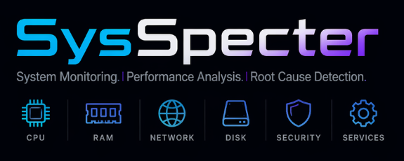

# SysSpecter — Windows Performance Diagnostic & Comparative Benchmark Framework

> **See everything. Find the cause.**

<p align="center"></p>

A Python tool for **evidence-based** Windows performance diagnostics and
cross-machine comparison. Built for admins and engineers handling
"my PC is slow" tickets, fleet rollouts (Autopilot vs reference image),
race-day workload diagnostics, and any situation where guessing isn't
good enough.

It does not just dump counters. It detects anomalies, slowdown
windows, resource leaks (memory + handle types + managed heap), ranks
offenders, classifies bottlenecks, attributes leaks as native-vs-
managed, surfaces deterministic deadlock signatures across multiple
runs, and refuses to draw cross-run conclusions when the data isn't
actually comparable. Output is a self-contained HTML report plus
machine-readable JSON / CSV artefacts.

## What's in v1.2.0

The v1.2.0 release closes the v3 production-test review (7 priorities,
all shipped). Headlines:

- **Cadence-honest sampling.** Every run records its actual cadence
  (`cadence_quality` block in `manifest.json`: `median_gap_seconds`,
  `gaps_over_2x_nominal`, `cadence_health`). The sampler runs at
  `HIGH_PRIORITY_CLASS` so it doesn't lose the scheduler race under
  load. `sample_late_ms` and `gap_seconds` columns in
  `timeline_system.csv` make every dropped tick visible.
- **Per-PID handle counts by object type** (`timeline_handles.csv`).
  File / Event / Section / Mutant / Thread / etc. via
  `NtQuerySystemInformation` — turns "vague handle leak" into
  "verified COM RCW leak" (Section + Event handles climbing
  together).
- **.NET CLR managed-heap counters** (`timeline_managed_heap.csv`).
  Per-process bytes-in-all-heaps, gen 0/1/2 sizes, GC pressure.
  Drives the **native-vs-managed leak attribution**: when RSS grows
  but the managed heap is flat, the leak is in unmanaged code.
- **Comparison engine that knows when not to compare.** Cadence
  asymmetry, peer-context mismatch, length bias, and broken-cadence
  participants all gate the headline verdicts. Confidence column on
  every root-cause hypothesis. Software-bloat rule distinguishes
  *installed* from *running*.
- **Same-host pattern detection** for `Before/after` mode: run-
  cluster signatures (4 of 6 runs leaking at the same slope = same
  bug), regime-change detection (worker-pool resize), deterministic-
  deadlock signature, cross-run invariants (e.g. ICMP blocked
  everywhere), top-N consistency, exclusion gates for not-comparable
  runs.
- **Cap-window-aware scoring** in comparisons — `last_1h` / `last_8h`
  tail-window scores chosen as the comparison frame so a longer run
  no longer wins by integrating over more samples.

See `CHANGELOG.md` for the per-priority detail.

## Quick start (60 seconds)

1. **Run `install.bat`** — picks up Python 3.12 / 3.13 / 3.14, builds
   the venv, installs pinned deps. Safe to re-run.
2. **Double-click `sysspecter-gui.bat`** — the GUI opens on the
   Monitor tab.
3. **Click "Start monitor"**. Let it run for the time you need
   (≥ 5 minutes for a meaningful baseline; ≥ 1 hour for cap-window-
   aligned cross-run comparison). Click **Stop**. Finalisation runs
   automatically.
4. **Switch to the Runs tab** and double-click your run — the HTML
   report opens in your browser.

Portable alternative: build once with `build_exe.bat`, copy
`dist\SysSpecter.exe` to a USB stick, double-click anywhere.

## Install

Requires Windows 10 / 11 and Python 3.12, 3.13 or 3.14.

```
py -m venv C:\Tools\SysSpecter\.venv
C:\Tools\SysSpecter\.venv\Scripts\python.exe -m pip install -r C:\Tools\SysSpecter\requirements.txt
C:\Tools\SysSpecter\.venv\Scripts\python.exe C:\Tools\SysSpecter\.venv\Scripts\pywin32_postinstall.py -install
```

Run via `sysspecter.bat`, which points at the venv's Python:

```
sysspecter.bat monitor --mode support
```

Or use the GUI wrapper (tabs for Monitor / Runs / Compare):

```
sysspecter-gui.bat
```

### Portable single-file EXE (USB-stick workflow)

Once `install.bat` has set up the venv:

```
build_exe.bat
```

Drops `dist\SysSpecter.exe` (~22 MB, single file). Copy to USB,
run on any Windows 10 / 11 host — no Python needed. Double-click
launches the GUI; CLI works too:

```
SysSpecter.exe monitor --mode support
SysSpecter.exe compare --input X:\SysSpecter\Runs
```

When running as a frozen EXE the default output root becomes
`<exe_dir>\SysSpecter\Runs`, so all reports stay on the stick.

## Permissions

Run in an **elevated (admin) terminal** for full coverage. A few data
sources need it:

- Handle counts on protected processes (`timeline_handles.csv`)
- ETW disk capture
- Some WMI classes for the static snapshot

Without admin the tool runs anyway: it logs a warning, marks
`privilege_level: user` in the manifest, and stamps
`mark_degraded(...)` for any sampler whose data could not be captured.
The report's "Collector degraded" banner makes the gaps explicit.

## Modes

| Mode | Default duration | Target required | Use case |
|------|------------------|-----------------|----------|
| `support` | manual stop | no | "my PC is slow" diagnostics |
| `baseline` | 1800 s | no | measure ground noise (idle, no workload) |
| `workload` | 1800 s | recommended | measure a stress test or specific app |
| *(compare)* | n/a | n/a | cross-run analysis |

Examples:

```
sysspecter.bat monitor --mode support
sysspecter.bat monitor --mode baseline --duration 600 --tag standard-build
sysspecter.bat monitor --mode workload --duration 900 --target-name MyApp.exe --tag autopilot
sysspecter.bat monitor --mode workload --duration 3600 --machine-class developer-workstation
sysspecter.bat compare --runs C:\Temp\SysSpecter\Runs\HOST1_... C:\Temp\SysSpecter\Runs\HOST2_...
sysspecter.bat compare --input C:\Temp\SysSpecter\Runs
sysspecter.bat aggregate --input C:\Temp\SysSpecter\Runs        # fleet aggregation
sysspecter.bat report --run C:\Temp\SysSpecter\Runs\HOST1_...   # rebuild reports
sysspecter.bat inspect --run C:\Temp\SysSpecter\Runs\HOST1_...  # quick console summary
```

Manual stop: press `Ctrl+C`, or create an empty file named `STOP` in
the run folder. Finalisation (end snapshot, analysis, report) always
runs.

## Common options

```
--mode support|baseline|workload
--duration <seconds>
--interval <seconds>           (default 1.0)
--target-name <exe name>
--target-pid <pid>
--target-path <absolute exe path>
--tag <label>                  (repeatable, goes into manifest)
--meta key=value               (repeatable, goes into manifest.meta)
--machine-class <name>         (developer-workstation / engineering-workstation
                                / general-knowledge-worker / kiosk
                                / terminal-server / factory-floor)
--profile <name>               (capture profile: leak-hunt / av-overhead / …)
--latency-target <host>        (repeatable; defaults: 127.0.0.1, 8.8.8.8, 1.1.1.1)
--output-root <dir>            (default C:\Temp\SysSpecter)
--manual-stop                  (force manual stop even in baseline/workload)
```

`--machine-class` is what the comparison engine reads for peer-group
classification (a developer workstation isn't a peer of a kiosk; the
engine surfaces a non-peer caveat when classes mismatch).

## Output

```
C:\Temp\SysSpecter\Runs\<HOSTNAME>_<RUNID>\
  manifest.json                # schema_version, sysspecter_version, machine_id,
                               #   cadence_quality, process_priority_class,
                               #   meta, capture_profile, phase3 + phase3_captured
  static_snapshot.json
  process_start_snapshot.json
  service_start_snapshot.json
  timeline_system.csv          # 1 row / second: CPU, RAM, disk, net + sample_late_ms + gap_seconds
  timeline_processes.csv       # 1 row per (second, candidate process) — incl. ppid, num_page_faults
  timeline_per_core.csv        # long-format per-core CPU
  timeline_handles.csv         # NEW v1.2: per-PID handle counts by object type (every 60 s)
  timeline_managed_heap.csv    # NEW v1.2: per-PID .NET CLR heap counters (every 30 s)
  timeline_network.csv         # 1 row per (second, adapter)
  timeline_latency.csv         # 1 row per (probe, target); probes every ~15 s
  timeline_connections.csv     # snapshot of TCP connections every 30 s
  timeline_gpu_*.csv           # GPU engine / process / adapter (when phase3.gpu)
  process_events.json          # start/stop events captured during the run
  service_events.json          # service state changes
  etw_disk.etl                 # raw ETW kernel-disk trace (when phase3.etw_disk)
  etw_disk.etl.csv             # parsed ETW disk events
  event_log.json               # filtered Windows Event Log (when phase3.event_logs)
  findings.json                # anomalies, slowdowns, leaks, deadlocks, process_tree,
                               #   periodicities, baseline_deviations, offenders, apps,
                               #   network_attribution, latency_analysis, gpu_analysis,
                               #   handle_leaks_by_type, managed_heap_leaks, …
  scores.json                  # stability/efficiency/workload/security/network/hygiene/overall
                               #   plus tail_windows (last_1h, last_8h) and analysis_window
  final_report.html            # primary human report, fully offline
  final_report.md              # markdown summary
  logs\
    collector.log
    analyzer.log
    reporter.log

C:\Temp\SysSpecter\Runs\Comparisons\<CMP_ID>\
  comparison_manifest.json
  comparison_matrix.csv        # incl. cadence_health, median_gap_s, process_priority_class
  comparison_findings.json     # cadence_quality_warnings, peer_mismatch_warnings,
                               #   same_host_findings, window_aligned_view, root_causes, …
  comparison_scores.json       # best_overall etc. + chosen_window
  comparison_report.html
  comparison_report.md
```

## Heuristics (summary)

### Anomalies
- CPU sustained > 85 % for ≥ 10 s → `cpu_sustained_high`
- Single-core pinned > 95 % while others < 50 % → `cpu_single_core_saturation`
- Memory used > 85 % sustained → `memory_pressure` (> 93 % → `high`)
- Swap used > 20 % → `swap_usage` (> 40 % → `medium`)
- Disk active > 85 % for ≥ 8 s → `disk_active_high`
- Latency peak ≥ 200 ms → `network_latency_spike` (≥ 500 ms → `high`)

### Slowdown windows
Contiguous second-ranges with at least one pressure reason. Windows
shorter than 3 s are dropped; gaps ≤ 5 s are merged. Each window
reports peak metrics, reason tags, top offender processes, and a
confidence tier (`suspicious` / `likely` / `strong evidence`).

### Leak heuristics

**Memory / handles / threads (aggregate)** — sliding-window linear
regression on per-process smoothed series. A candidate requires
≥ 120 s window, slope above the mode-aware threshold (stack-aware:
JVM ≠ .NET ≠ Python ≠ browsers), and meaningful cumulative growth.
Confidence tiers depend on slope magnitude and growth ratio.

**Per-(PID, object type) handle leaks** *(new in v1.2)* — slope
detection on `timeline_handles.csv`. Thresholds: 5 / 30 / 200
handles/min for low / medium / high severity. Noisy types (`Job`,
`Driver`) excluded.

**RCW signature** *(new in v1.2)* — when a process leaks `Section`
AND `Event` handles in tandem (both ≥ medium threshold), emits an
explicit COM Runtime-Callable-Wrapper finding.

**Managed-heap leaks** *(new in v1.2)* — gen-2 slope detection at 50
KB / 500 KB / 5 MB per minute thresholds. `gen2_collections_observed`
flags "leak despite GC pressure" — the textbook retained-roots
scenario.

**Native-vs-managed attribution** *(new in v1.2)* — when RSS grows
but the managed heap is flat (managed share < 20 %), the leak is in
unmanaged memory (C / C++ / COM). `ratio_native_share` quantifies it.

**Deadlock-after-leak** — a process whose memory plateaued AND
handles plateaued AND CPU dropped to ~ 0 in the run's tail window.

**Periodic patterns** — autocorrelation on 5-second bins. Surfaces
Defender / EDR / scheduler cycles.

### Scoring

Each score is 0–100, higher = better:

- **Stability** — penalises CPU/mem variance and medium/high anomalies
- **Efficiency** — rewards idle headroom, penalises background noise
- **Workload suitability** — fraction of time *not* in a slowdown window
- **Security overhead** — penalises AV / EDR / management-agent cost
- **Network impact** — penalises avg / p95 latency and loss
- **Resource hygiene** — penalises leak candidates, weighted by tier

Overall is weighted: stability 0.25, efficiency 0.15, workload 0.15,
security 0.10, network 0.15, hygiene 0.20. Confidence depends on
sample count (< 60 → low, ≥ 600 → high).

**Tail-window scoring** *(A6)* — every run that's at least 1 hour
long also gets `last_1h` and `last_8h` score blocks. The comparison
engine prefers these over full-run scores when all participating
runs are long enough, so a longer run no longer wins by accident.

## Compare workflow

```
sysspecter.bat monitor --mode workload --duration 3600 --target-name MyApp.exe --machine-class developer-workstation --tag autopilot
sysspecter.bat monitor --mode workload --duration 3600 --target-name MyApp.exe --machine-class developer-workstation --tag standard-build

sysspecter.bat compare --runs <autopilot_run> <standard_run>
```

The comparison report opens with banners that gate the headline
verdicts:

| Banner | Triggers when |
|---|---|
| **Cadence quality — comparison caveat** | One run sampled significantly slower than another (e.g. broken cadence on a weak host) |
| **Peer context — non-peer comparison** | Runs declare different `machine_class` (e.g. workstation vs office) |
| **Cap-window-aligned scoring** | All runs ≥ 1 h → headline verdicts use `last_1h` (length-fair); otherwise an amber "alignment unavailable" banner |

Then the verdicts (`best_overall`, `most_stable`, `best_efficiency`,
`lowest_cpu_avg`, `lowest_p95_latency`, `fewest_anomalies`), each
tagged with `on last_1h` or `cadence-degraded ranking` as
appropriate. Below that: the metric matrix, hardware / software /
config diff, root-cause hypotheses (with severity AND confidence
columns), and same-host pattern findings when in `Before/after`
mode.

### Comparison modes

Auto-detected from hostnames:

- `before_after` — all runs share a hostname (same machine across
  time). Triggers the seven same-host rule families: run-cluster,
  regime-change, deterministic-deadlock, cross-run invariants,
  top-N consistency, exclusion gates.
- `pair_diagnosis` — exactly two distinct hostnames. Hardware /
  software / config diffs feature heavily.
- `fleet` — three or more distinct hostnames. Cross-run invariants
  and exclusions still fire; same-host-only rules are skipped.

## Aggregator (fleet view)

For larger fleets the `aggregate` subcommand consumes the per-run
JSON artefacts into distributions, outliers, and longitudinal drift:

```
sysspecter.bat aggregate --input C:\FleetRuns --output C:\FleetReport
```

Produces a fleet-level HTML report: histograms of every score
across the fleet, P95 outlier flags, per-`machine_class` baselines,
and machine-id-stable longitudinal drift (so a hostname rename
doesn't make a host look "new" to the aggregator).

## Privacy & multi-tenant

- **Capture-time redaction** (M1). Tags and meta values can be
  hashed at capture (`MACHINE-xxxxxxxx`, `HOST-xxxx`) instead of
  carrying real names — set `--redact-identifiers`.
- **Stable `machine_id`** survives hostname renames: SMBIOS UUID →
  Windows Machine SID → MAC + Machine-SID hash, with the source
  recorded in `manifest.machine_id_source`.
- **Structured fleet metadata** in `manifest.meta` (department,
  ticket ID, scenario) — separate from free-form `tags` so the
  aggregator can filter without parsing strings.

## How to read the report

The HTML report opens with a brand-coloured header and key metadata,
then a stack of banners and sections you should read top-down.

| Banner | Meaning | Action |
|---|---|---|
| **Running as standard user** (red) | Not running as Administrator. Some signals (handles on protected processes, ETW disk I/O) are missing. | Re-run elevated if those signals matter. |
| **Collector degraded** (red) | A sampler failed mid-run. The named collector's data is incomplete. | Open `logs/collector.log` for the exception. |
| **Low sample count / cadence drift** (yellow) | The run captured fewer samples than the manifest's nominal cadence implies. The `cadence_quality` block tells you the median gap and the over-2× / over-5× counts. | If `cadence_health` is `broken`, treat aggregate metrics on this run with caution; comparisons against this run may exclude it from sample-density-sensitive rankings. |

**Executive summary** states the verdict in one sentence and lists the
six scores with confidence pills. The primary + secondary
bottlenecks summarise the pressure axes that accumulated the most
evidence.

**Slowdown windows** each have a confidence tier (`suspicious` /
`likely` / `strong evidence`).

**Leak candidates** for memory, handles, threads, per-handle-type,
and managed heap. A `strong evidence` memory leak combined with a
matching RCW signature on the same PID is usually worth reproducing
and capturing an ETW trace for.

**Offenders + apps** — top consumers across CPU, RAM, handles, I/O.

**Recommendations** at the bottom are observations and pointers,
not automated fixes. Each is tagged with severity AND confidence so
the reader can see at a glance how strong the causal claim is.

## Low-overhead design

- 1-second "cheap" collectors use `psutil` on a **rolling top-N
  candidate set** (CPU / RAM / handles / I/O union), not every
  process every second.
- Candidate set refreshes every 10 s via a full enumeration.
- Expensive tier (service state, process tree diff, latency probes)
  runs every 15–30 s on a separate cadence.
- Handle-table snapshot every 60 s; .NET CLR Memory snapshot every
  30 s — both via direct kernel APIs (`NtQuerySystemInformation`,
  PDH).
- CSVs stream to disk and flush every 10 s — no in-memory
  accumulation.
- The collector process self-elevates to `HIGH_PRIORITY_CLASS` so it
  doesn't lose the scheduler race under load. Soft-degrades to
  `ABOVE_NORMAL` or `NORMAL` when the OS denies the bump.

## Troubleshooting

| Symptom | Likely cause | Fix |
|---|---|---|
| `sysspecter stop` says "no active session found" on a session that is clearly running | Tool version < 1.0.0 (collector heartbeat wasn't throttled to the log) | Upgrade. From 1.0.0 on the collector touches `collector.log` every 10 s. |
| `cadence_health: broken` in `manifest.json` despite a beefy host | Background scanner / EDR competing for CPU; or `--interval 1.0` on a 4-core host while many .NET apps are running | Re-capture with `--interval 5`; or run elevated so HIGH_PRIORITY_CLASS sticks. |
| `timeline_handles.csv` is empty | Locked-down host, missing ntdll, or no admin. Manifest will have `mark_degraded.handles_sampler`. | Check `logs/collector.log`. Re-run elevated if applicable. |
| `timeline_managed_heap.csv` is empty | Host has no .NET Framework apps running (or .NET Core only — its counters are EventSource-based, not PDH). | Expected on .NET-Core-only hosts. Manifest stamps `mark_degraded.managed_heap_sampler` so the report flags the gap. |
| Comparison report says "Cap-window alignment unavailable" | At least one run is shorter than 1 hour. | Re-capture with `--duration 3600` so all runs hit `last_1h`. |
| Comparison `chosen_window: full_run` (instead of `last_1h`) | Same as above — not enough length for a canonical tail window. | As above. |
| SmartScreen blocks `SysSpecter.exe` on first launch | EXE is unsigned. | Click "More info" → "Run anyway". Re-appears per machine until we ship a signed build (tracked in `BUILDING.md`). |
| Report shows "ETW disk capture not enabled" even though `--etw` was passed | Not running elevated, or a stale `NT Kernel Logger` session is still live | Run as Administrator. If the problem persists, run `logman stop "NT Kernel Logger" -ets` once. |
| GUI window just flashes / disappears | Hidden exception in a tab's constructor | Launch via `sysspecter.bat gui` (not `-gui.bat`) so the traceback is visible. |
| "Output folder is not writable" on USB | Stick is read-only, full, or path has Windows-rejected characters | Re-insert the stick, test another path with `--output-root D:\SysSpecter`, or format as NTFS / exFAT. |
| Run folder exists but no `final_report.html` | Monitor was killed hard before finalisation could run | `sysspecter report --run <folder>` rebuilds it; manifest is repaired on the fly. |
| `psutil ImportError` when running `sysspecter.bat` | The venv's Python is broken or wrong interpreter on PATH | Re-run `install.bat`. |

If the tool crashes in a way not covered here, capture
`logs/collector.log`, `logs/analyzer.log`, `logs/reporter.log` from
the affected run folder (plus the GUI console if running
`sysspecter.bat gui`) before re-running.

## Known limitations

- **Unsigned EXE.** Windows SmartScreen warns on first run. See
  `BUILDING.md` for the customer-facing bypass and the code-signing
  path.
- **Disk active %** is computed from `psutil.busy_time`; accuracy
  depends on Windows counter behaviour for the volume. NVMe
  controllers service many concurrent ops without blocking, so
  values can be biased low. Treat near-100 % as "likely saturated"
  rather than absolute truth.
- **JVM and Python managed-heap counters** are deferred. The current
  managed-heap sampler reads `.NET CLR Memory` only. JVM (via JMX)
  and Python (`tracemalloc`) are scoped for a follow-up.
- **`net_connections(kind="tcp")`** requires elevated rights on some
  systems; the CSV stores `-1` when the call is denied.
- **Cross-platform** support is Windows-only by design (uses WMI,
  PowerShell, ETW, PDH, `NtQuerySystemInformation`). The code has a
  platform-abstraction layer (C5) for future Linux / macOS work but
  no non-Windows backend exists yet.
- The tool does **not** modify system state. Recommendations in the
  report are observations, not automated fixes.

## License / Copyright

© 2026 David Juriga. All rights reserved.
